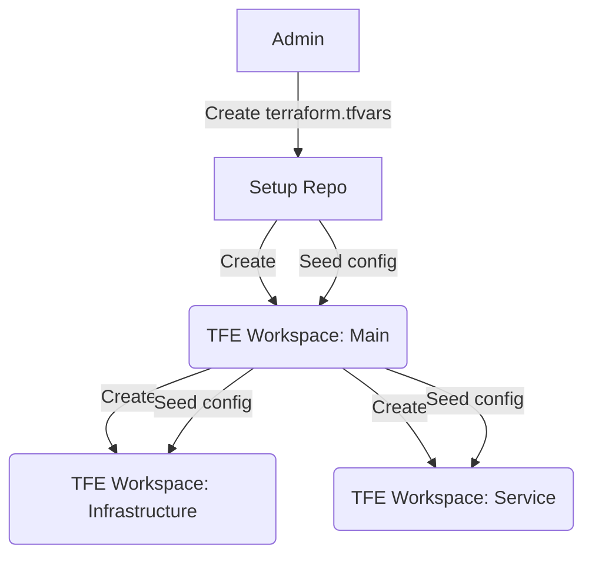

# Infrastructure as code

Basic principles:
- Use code to create and manage infrastructure
- Describe desired result using a declarative configuration language
- Fully automated change management

We want to use CICD to create the infrastructure underlying our applications. 
We want to manage this infrastructure using a modern development process: 

- Change management through 
    - Code reviews 
    - Automated testing
- Track changes using commit messages and blame
- Automated delivery

# Tool stack

- Hashicorp Terraform
- HCL 2.0
- Azure AD account
- Azure Subscription
- AzureRM provider for terraform
- Hashicorp Nomad

# Provisioning flow
