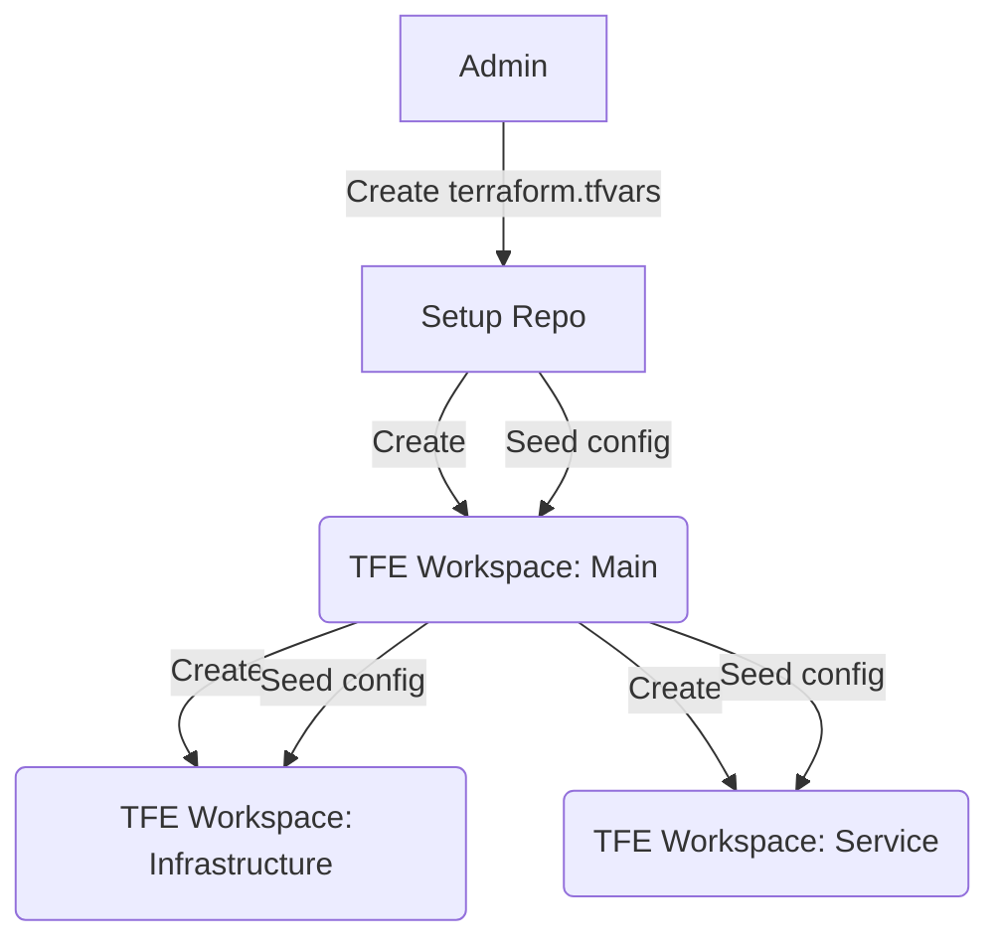

# Setup IaC demo
This repository is "step zero" of the IaC demo, and needs to be run once.

The scripts and terraform code here will take care of seeding the initial facts and secrets required to enable Terraform Cloud to perform configuration and provisioning against itself and the Azure subscription provided.

## Instuctions
TODO

#  About the IaC demo

Basic principles:
- Use code to create and manage infrastructure
- Describe desired result using a declarative configuration language
- Fully automated change management

We want to use CICD to create the infrastructure underlying our applications. 
We want to manage this infrastructure using a modern development process: 

- Change management through 
    - Code reviews 
    - Automated testing
- Track changes using commit messages and blame
- Automated delivery

# Tool stack

- Hashicorp Terraform
- HCL 2.0
- Azure AD account
- Azure Subscription
- AzureRM provider for terraform
- Hashicorp Nomad

# Provisioning flow
<a href="Flow"><src="https://mermaid-js.github.io/mermaid-live-editor/#/view/eyJjb2RlIjoiZ3JhcGggVERcbiAgMFtBZG1pbl0gLS0-fENyZWF0ZSB0ZXJyYWZvcm0udGZ2YXJzfCBBXG4gIEFbU2V0dXAgUmVwb10gLS0-fENyZWF0ZXwgQihURkUgV29ya3NwYWNlOiBNYWluKVxuICBBIC0tPnxTZWVkIGNvbmZpZ3wgQlxuICBCIC0tPnxDcmVhdGV8IEMoVEZFIFdvcmtzcGFjZTogSW5mcmFzdHJ1Y3R1cmUpXG4gIEIgLS0-fFNlZWQgY29uZmlnfCBDXG4gIEIgLS0-fENyZWF0ZXwgRChURkUgV29ya3NwYWNlOiBTZXJ2aWNlKVxuICBCIC0tPnxTZWVkIGNvbmZpZ3wgRCIsIm1lcm1haWQiOnsidGhlbWUiOiJkZWZhdWx0In0sInVwZGF0ZUVkaXRvciI6ZmFsc2V9">

